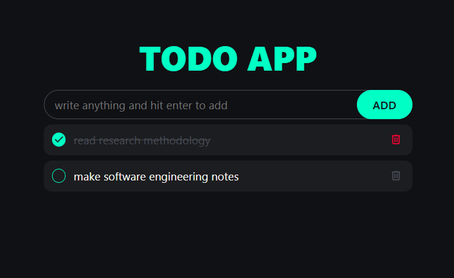

# warren-jaftha-TO DO LIST

## Project Description

The "warren-jaftha" project is a web-based Todo application designed to help users manage their tasks efficiently. Built using HTML, CSS, and JavaScript, this application allows users to add, complete, and delete tasks seamlessly. It also leverages the browser's local storage to ensure tasks persist between sessions, providing a reliable and user-friendly experience.

## Features

- **Add Tasks**: Quickly add new tasks to your list by typing into the input field and pressing Enter.
- **Complete Tasks**: Mark tasks as complete by clicking on them, which applies a strikethrough effect.
- **Delete Tasks**: Remove tasks from your list by clicking the delete icon next to each task.
- **Persistent Storage**: Tasks are saved in local storage, ensuring your list remains intact even after refreshing or closing the browser.

## Getting Started

Follow these instructions to set up and run the project locally.

### Prerequisites

This project is built with standard web technologies and does not require any external dependencies or installations. All you need is a modern web browser to run the application.

### Installation

1. **Clone the Repository**:
   - Open your terminal or command prompt.
   - Execute the following command to clone the repository:
     ```bash
     git clone https://github.com/Wareezy/warren-jaftha.git
     ```
   - Navigate into the project directory:
     ```bash
     cd warren-jaftha
     ```

2. **Open the Application**:
   - Locate the `index.html` file within the project directory.
   - Double-click on `index.html` to open it in your default web browser.

   Alternatively, you can serve the application using a local development server for better performance and live reloading capabilities.

   - **Using Visual Studio Code with Live Server Extension**:
     - Open the project directory in Visual Studio Code.
     - Install the "Live Server" extension if you haven't already.
     - Right-click on `index.html` and select "Open with Live Server".
     - The application will launch in your default browser, and any changes made to the code will automatically reflect in the browser.

   - **Using `http-server`**:
     - Ensure you have Node.js installed on your machine.
     - Install `http-server` globally by running:
       ```bash
       npm install -g http-server
       ```
     - Start the server in the project directory:
       ```bash
       http-server
       ```
     - Open your browser and navigate to the provided local server address (e.g., `http://localhost:8080`).

## Images/Screenshots

Below is a screenshot demonstrating the application's interface:

- General look of the to-do list.


- When adding values into the to-do list.


- When you complete tasks with the to-do list.


- When you delete a task from the to-do list.

